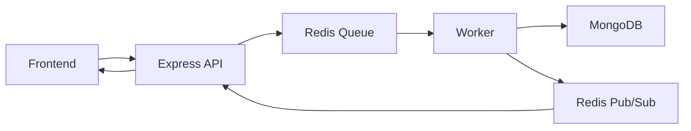

echnology Choices (Why)
Redis + BullMQ

Good for distributed queues

Handles retries

Durable job metadata

Perfect for background processing

Worker as separate process

Avoids blocking Express server.

MongoDB

Flexible schema

Easy storage for job posts and logs

Socket.IO

Real-time communication

Works well with Redis adapter

Simplifies WebSocket implementation

xml2js

Handles messy XML/HTML from RSS feeds.
